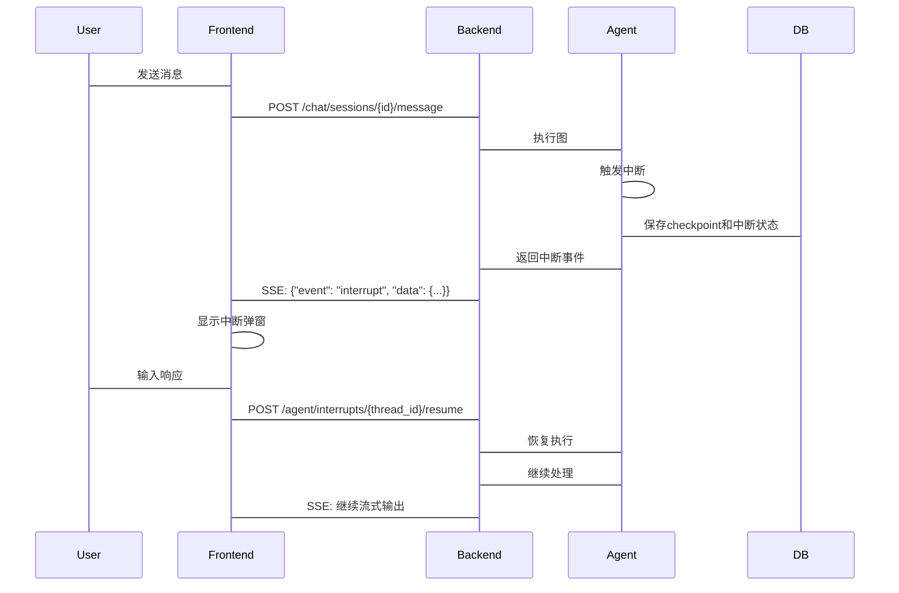
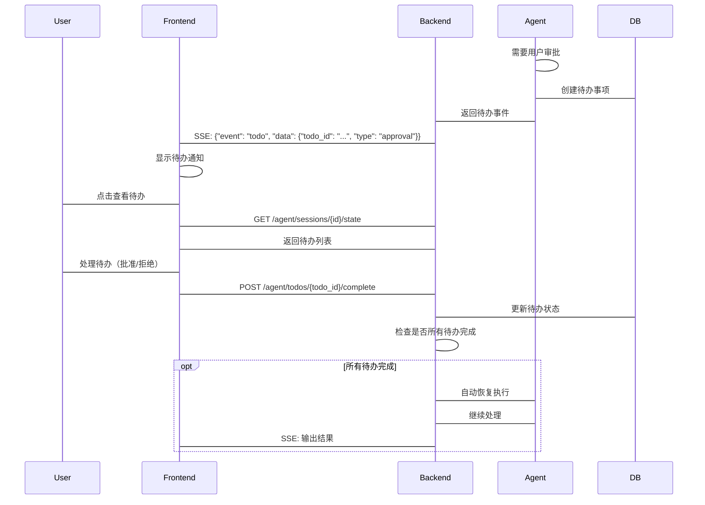

# Agent状态持久化设计方案

## 概述

本文档描述了DeepResearcher项目中Agent状态持久化的完整设计方案，包括数据存储、中断恢复、前后端交互等核心功能。

## 1. 持久化架构

### 1.1 存储架构
```
┌─────────────────────────────────────────────────────────────┐
│                    Agent状态持久化架构                       │
├─────────────────────────────────────────────────────────────┤
│  ┌─────────────┐  ┌──────────────┐  ┌──────────────────┐   │
│  │   内存缓存   │  │  PostgreSQL  │  │     Redis        │   │
│  │  (运行时)   │  │  (持久化)    │  │   (可选缓存)     │   │
│  └──────┬──────┘  └──────┬───────┘  └────────┬─────────┘   │
│         │               │                    │             │
│  ┌──────┴───────────────┴────────────────────┴──────────┐   │
│  │              LangGraph Checkpointer                  │   │
│  └─────────────────────┬────────────────────────────────┘   │
│                        │                                    │
│  ┌─────────────────────┴────────────────────────────────┐   │
│  │            EnhancedCheckpointSaver                   │   │
│  │  (集成checkpointer和自定义持久化逻辑)                │   │
│  └─────────────────────┬────────────────────────────────┘   │
│                        │                                    │
│  ┌─────────────────────┴────────────────────────────────┐   │
│  │           AgentPersistenceService                    │   │
│  │  (管理Agent会话、中断、待办事项)                     │   │
│  └──────────────────────────────────────────────────────┘   │
└─────────────────────────────────────────────────────────────┘
```

### 1.2 数据流
1. Agent运行时状态保存在内存中
2. 每个节点执行后，LangGraph自动调用checkpointer保存状态
3. EnhancedCheckpointSaver同时更新自定义持久化数据（中断、待办等）
4. 前端通过API查询和恢复Agent状态

## 2. 前端交互流程

### 2.1 正常执行流程
```
用户输入 → 创建会话 → 执行Agent → 流式输出 → 完成
```

### 2.2 强中断处理流程
```
Agent执行 → 触发强中断 → 保存状态 → 前端弹窗 → 用户输入 → 恢复执行
```

**详细流程：**


### 2.3 弱中断处理流程
```
Agent执行 → 触发弱中断 → 创建待办 → 前端显示 → 用户处理 → 完成待办 → 自动恢复
```

**详细流程：**


## 3. 前端组件设计

### 3.1 中断处理组件
```typescript
// 中断弹窗组件
interface InterruptModalProps {
  interruptInfo: InterruptInfo;
  onSubmit: (input: any) => void;
  onCancel: () => void;
}

const InterruptModal: React.FC<InterruptModalProps> = ({ interruptInfo, onSubmit, onCancel }) => {
  const renderInterruptContent = () => {
    switch (interruptInfo.reason) {
      case 'need_approval':
        return (
          <div>
            <p>{interruptInfo.message}</p>
            <Button onClick={() => onSubmit(true)}>批准</Button>
            <Button onClick={() => onSubmit(false)}>拒绝</Button>
          </div>
        );
      case 'need_input':
        return (
          <div>
            <p>{interruptInfo.message}</p>
            <Input placeholder={interruptInfo.payload?.placeholder} />
            <Button onClick={() => onSubmit(inputValue)}>提交</Button>
          </div>
        );
      case 'need_selection':
        return (
          <div>
            <p>{interruptInfo.message}</p>
            <Select onChange={(value) => setSelectedValue(value)}>
              {interruptInfo.options?.map((option, index) => (
                <Option key={index} value={index}>{option}</Option>
              ))}
            </Select>
            <Button onClick={() => onSubmit(selectedValue)}>确认</Button>
          </div>
        );
      default:
        return null;
    }
  };

  return (
    <Modal open={!!interruptInfo} onCancel={onCancel}>
      {renderInterruptContent()}
    </Modal>
  );
};
```

### 3.2 待办事项组件
```typescript
// 待办事项列表组件
interface TodoItem {
  id: string;
  type: string;
  data: any;
  message: string;
}

interface TodoListProps {
  todos: TodoItem[];
  onComplete: (todoId: string, result: any) => void;
}

const TodoList: React.FC<TodoListProps> = ({ todos, onComplete }) => {
  return (
    <div className="todo-list">
      <h3>待处理事项 ({todos.length})</h3>
      {todos.map(todo => (
        <TodoCard
          key={todo.id}
          todo={todo}
          onComplete={(result) => onComplete(todo.id, result)}
        />
      ))}
    </div>
  );
};
```

### 3.3 状态恢复组件
```typescript
// 会话状态恢复组件
const SessionStateRecovery: React.FC = () => {
  const { data: stateSummary } = useAgentSessionState(chatSessionId);
  const { mutate: restoreSession } = useRestoreAgentSession();

  const handleResumeInterrupted = async (threadId: string) => {
    const response = await restoreSession({ threadId });

    if (response.data.can_resume) {
      if (response.data.interrupt_info) {
        // 显示中断弹窗
        setInterruptInfo(response.data.interrupt_info);
      } else if (response.data.todos) {
        // 显示待办列表
        setTodos(response.data.todos);
      }
    }
  };

  return (
    <div>
      {stateSummary?.has_interrupted && (
        <Alert
          message="有中断的 Agent 会话"
          description="点击恢复中断的会话"
          action={
            <Button onClick={() => handleResumeInterrupted(threadId)}>
              恢复会话
            </Button>
          }
        />
      )}
      <InterruptModal
        interruptInfo={interruptInfo}
        onSubmit={handleInterruptSubmit}
        onCancel={handleInterruptCancel}
      />
      <TodoList
        todos={todos}
        onComplete={handleTodoComplete}
      />
    </div>
  );
};
```

## 4. API使用示例

### 4.1 前端获取会话状态
```typescript
// 获取会话状态摘要
const fetchSessionState = async (chatSessionId: string) => {
  const response = await api.get(`/agent/sessions/${chatSessionId}/state`);
  return response.data;
};

// 恢复中断的会话
const resumeInterruptedSession = async (threadId: string, userInput?: any) => {
  const response = await api.post(`/agent/sessions/${threadId}/restore`, {
    resume_data: { user_input: userInput }
  });
  return response.data;
};

// 完成待办事项
const completeTodo = async (todoId: string, resultData: any) => {
  const response = await api.post(`/agent/todos/${todoId}/complete`, {
    result_data: resultData
  });
  return response.data;
};
```

### 4.2 SSE事件处理
```typescript
// 处理SSE事件
const handleSSEvent = (event: MessageEvent) => {
  const data = JSON.parse(event.data);

  switch (data.event) {
    case 'interrupt':
      // 处理中断事件
      setInterruptInfo(data.data);
      break;

    case 'todo':
      // 处理待办事件
      addTodo(data.data);
      break;

    case 'error':
      // 处理错误事件
      handleError(data.data);
      break;

    default:
      // 处理其他事件（token、tool等）
      handleChatEvent(data);
  }
};
```

## 5. 错误处理和重试机制

### 5.1 前端错误处理
```typescript
// 统一的错误处理
const handleAgentError = (error: any) => {
  if (error.response?.status === 404) {
    message.error('会话不存在或已过期');
  } else if (error.response?.status === 400) {
    message.error(error.response.data.detail || '请求参数错误');
  } else {
    message.error('服务异常，请稍后重试');
  }
};

// 重试机制
const retryOperation = async (operation: () => Promise<any>, maxRetries = 3) => {
  for (let i = 0; i < maxRetries; i++) {
    try {
      return await operation();
    } catch (error) {
      if (i === maxRetries - 1) throw error;
      await new Promise(resolve => setTimeout(resolve, 1000 * (i + 1)));
    }
  }
};
```

## 6. 性能优化建议

### 6.1 前端优化
1. **状态缓存**：使用React Query或SWR缓存会话状态
2. **懒加载**：只在需要时加载历史记录
3. **分页加载**：大量历史记录时分页获取
4. **乐观更新**：待办事项完成后立即更新UI

### 6.2 后端优化
1. **数据库索引**：确保关键字段有索引
2. **异步处理**：使用Celery处理耗时操作
3. **连接池**：合理使用数据库连接池
4. **缓存策略**：对不常变化的数据使用Redis缓存

## 7. 安全考虑

### 7.1 权限控制
1. **用户隔离**：确保用户只能访问自己的会话
2. **会话验证**：每次操作都验证会话归属
3. **输入校验**：严格校验用户输入
4. **速率限制**：防止API滥用

### 7.2 数据安全
1. **敏感数据加密**：对敏感信息进行加密存储
2. **审计日志**：记录关键操作
3. **数据脱敏**：返回给前端的数据进行脱敏处理

## 8. 监控和调试

### 8.1 前端监控
```typescript
// 记录Agent执行时间
const trackAgentExecution = (agentType: string, startTime: number) => {
  const duration = Date.now() - startTime;
  analytics.track('Agent Execution', {
    agentType,
    duration,
    timestamp: new Date().toISOString()
  });
};

// 记录中断事件
const trackInterrupt = (interruptType: string, reason: string) => {
  analytics.track('Agent Interrupt', {
    interruptType,
    reason,
    timestamp: new Date().toISOString()
  });
};
```

### 8.2 调试工具
1. **状态查看器**：开发模式下查看完整状态
2. **时间旅行**：支持回退到之前的状态
3. **事件日志**：记录所有事件和状态变化

## 9. 总结

本方案提供了完整的Agent状态持久化解决方案，包括：

1. **双轨存储**：LangGraph checkpointer + 自定义持久化
2. **灵活中断**：支持强中断和弱中断两种模式
3. **统一接口**：前后端通过标准化API交互
4. **用户体验**：无缝的状态恢复和继续执行
5. **可扩展性**：支持新的Agent类型和中断类型

通过这套方案，可以实现Agent的可靠持久化，支持复杂的人机交互场景，提升用户体验。