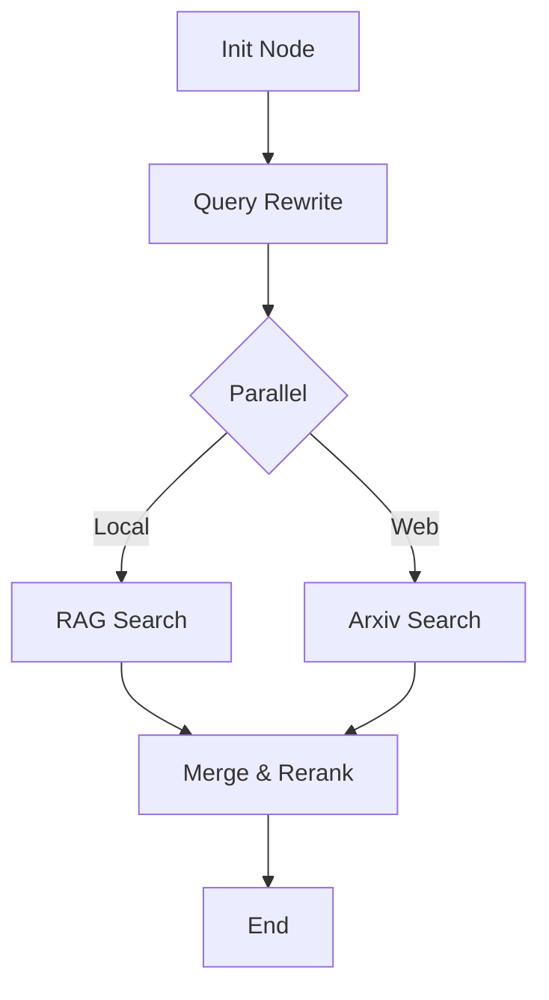
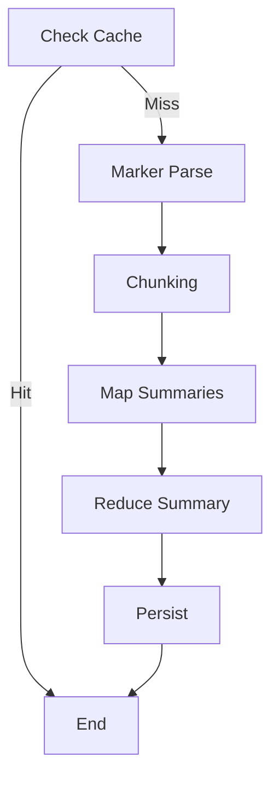

# Agent 系统详细实现设计文档

**文档信息**
- **负责人**: LangGraphAgent
- **日期**: 2026-01-07
- **关联任务**: T-011
- **状态**: Review Needed

---

## 1. 基础架构设计

### 1.1 状态基类 (Base State)
所有 Agent 必须继承此基类，确保上下文和消息的一致性。

```python
from typing import TypedDict, Annotated, List, Any
from langgraph.graph.message import add_messages
from langchain_core.messages import BaseMessage

class BaseAgentState(TypedDict):
    """
    所有 Agent 的基础状态
    """
    # 面向用户的对话历史 (User <-> Agent)
    messages: Annotated[List[BaseMessage], add_messages]
    
    # Agent 内部思考/工具调用链 (System <-> Tool)
    # 用于隔离用户视图，防止 Prompt 过长或包含敏感/冗余的中间步骤
    context: Annotated[List[BaseMessage], add_messages]
    
    # 运行时元数据 (不参与 LLM 推理，仅用于控制流)
    metadata: dict[str, Any]
```

### 1.2 运行时上下文 (Runtime Context)
通过 `langgraph` 的 `config` 注入，不存储在 State 中。

```python
class AgentRuntimeConfig(TypedDict):
    user_id: str
    session_id: str
    model_name: str = "deepseek-chat"
    language: str = "zh-CN"
```

---

## 2. 核心 Agent 设计

### 2.1 AI 搜索 Agent (SearchAgent)

**目标**: 执行混合检索（本地 RAG + 网络 Arxiv），并对结果进行重排。

**状态定义**:
```python
class SearchAgentState(BaseAgentState):
    query: str                      # 原始查询
    rewritten_queries: List[str]    # 改写后的查询列表
    search_results: List[dict]      # 原始检索结果
    ranked_papers: List[dict]       # 重排后的论文列表
```

**图编排 (Graph)**:


**关键工具**:
1.  `hybrid_rag_search(query: str, top_k: int)`: 
    *   调用 PGVector 执行 Vector + Keyword (RRF) 检索。
2.  `arxiv_search(query: str, max_results: int)`:
    *   调用 Arxiv API 获取最新论文元数据。

### 2.2 论文总结 Agent (SummarizerAgent)

**目标**: 读取 PDF，使用 Marker 解析，生成结构化摘要。

**状态定义**:
```python
class SummarizerState(BaseAgentState):
    paper_id: str
    pdf_path: str
    parsed_markdown: str    # Marker 解析结果
    summary_sections: dict  # 分段摘要 {section_name: summary}
    final_summary: str      # 最终摘要
```

**图编排 (Graph)**:


**关键技术**:
*   **Marker Parse Node**: 异步调用 Marker 转换 PDF。若文件过大，需在此处实现 Checkpoint 机制。
*   **Map-Reduce**: 针对长论文，先对每个章节做摘要，再合并生成全文摘要。

### 2.3 脑图生成 Agent (MindMapAgent)

**目标**: 基于摘要生成层级化的脑图数据 (JSON)。

**状态定义**:
```python
class MindMapNode(TypedDict):
    id: str
    label: str
    children: List['MindMapNode']

class MindMapState(BaseAgentState):
    paper_id: str
    summary: str
    mindmap: MindMapNode
```

**结构化输出**:
使用 Pydantic 定义 LLM 输出 Schema，确保生成的 JSON 严格符合前端 Reagraph 组件要求。

### 2.4 论文内对话 Agent (InPaperChatAgent)

**目标**: 针对特定论文内容的问答。

**状态定义**:
```python
class InPaperChatState(BaseAgentState):
    paper_id: str
    current_chunk_ids: List[str] # 当前引用的切片ID
```

**图编排**:
典型的 RAG Loop: `Retrieve` -> `Grade` -> `Generate`。

---

## 3. 数据库模型设计 (SQLModel)

为了支持上述 Agent，需要以下后端数据模型 (在 `backend/src/base/business_model` 中实现)：

```python
class Paper(SQLModel, table=True):
    id: UUID = Field(default_factory=uuid4, primary_key=True)
    title: str
    authors: List[str] = Field(sa_column=Column(JSON))
    abstract: str
    url: str
    local_path: str | None
    
    # 关联
    chunks: List["PaperChunk"] = Relationship(back_populates="paper")
    summaries: List["PaperSummary"] = Relationship(back_populates="paper")

class PaperChunk(SQLModel, table=True):
    id: UUID = Field(default_factory=uuid4, primary_key=True)
    paper_id: UUID = Field(foreign_key="paper.id")
    content: str
    embedding: List[float] = Field(sa_column=Column(Vector(1536))) # pgvector
    
    paper: Paper = Relationship(back_populates="chunks")
```

---

## 4. 接口契约 (API)

前端通过 SSE (Server-Sent Events) 与 Agent 交互。

**Endpoint**: `POST /api/agent/chat`
**Payload**:
```json
{
  "agent_id": "search_agent", 
  "message": "查找关于 Transformer 的最新论文",
  "context": {
    "mode": "deep_research" 
  }
}
```

**Response (Stream)**:
```text
event: metadata
data: {"run_id": "..."}

event: message
data: {"content": "收到，正在为您检索...", "role": "ai"}

event: tool_start
data: {"tool": "arxiv_search", "input": "Transformer attention"}

event: tool_end
data: {"output": "Found 5 papers..."}

event: message
data: {"content": "根据检索结果，推荐以下论文..."}
```

---

## 5. 开发优先级

1.  **P0**: 实现 `Paper` 和 `PaperChunk` 数据模型及 PGVector 迁移脚本。
2.  **P0**: 实现 `Marker` 解析工具封装 (需处理依赖和环境)。
3.  **P1**: 实现 `SearchAgent` (最常用)。
4.  **P1**: 实现 `SummarizerAgent` (核心体验)。
5.  **P2**: `MindMapAgent` 和 `InPaperChatAgent`。

