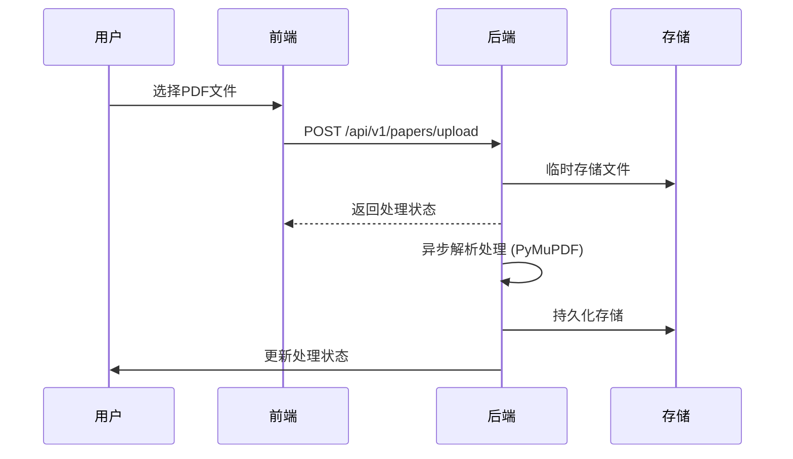
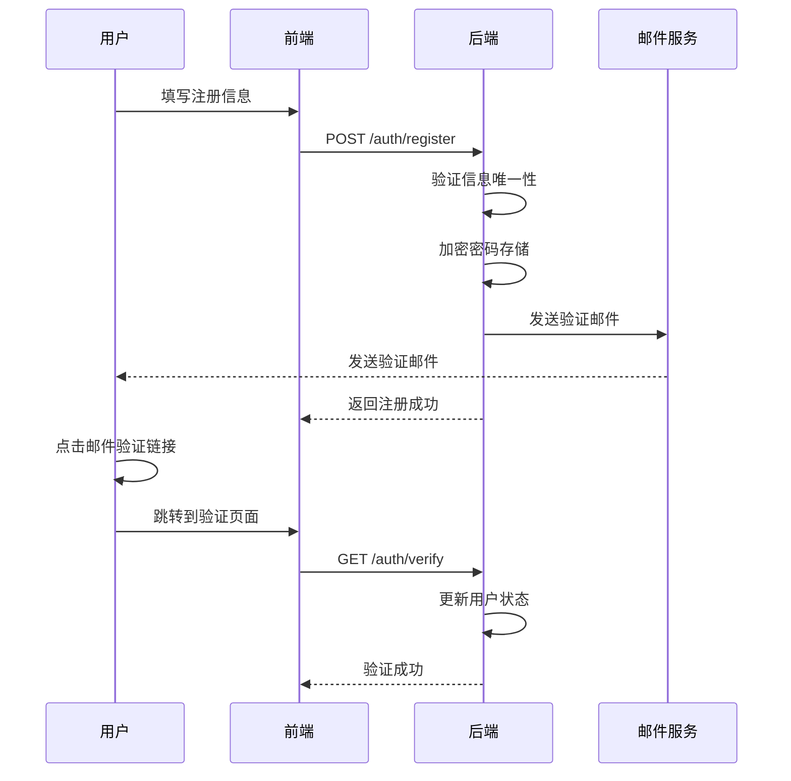
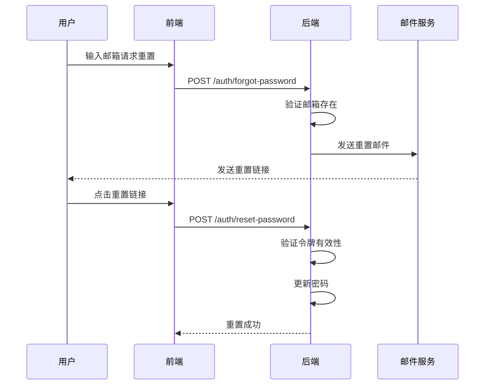

# PDF处理与鉴权系统技术文档

## 目录

1. [PDF处理流程](#pdf处理流程)
   - 1.1 引言
   - 1.2 系统架构概述
   - 1.3 PDF处理流程详解
   - 1.4 技术实现细节
   - 1.5 部署和运维

2. [鉴权系统](#鉴权系统)
   - 2.1 引言
   - 2.2 系统架构概述
   - 2.3 认证流程详解
   - 2.4 授权机制
   - 2.5 安全实现
   - 2.6 技术实现细节

---

## PDF处理流程

### 1.1 引言

#### 1.1.1 文档目的
本文档详细描述了PDF文件在系统中的完整处理流程，包括上传、存储、解析、访问和展示等环节的技术实现方案。

#### 1.1.2 适用范围
适用于所有涉及PDF文件处理的业务场景，包括学术论文管理系统、文档共享平台等。

#### 1.1.3 术语定义
- **PDF**: Portable Document Format，便携式文档格式
- **OCR**: Optical Character Recognition，光学字符识别
- **CDN**: Content Delivery Network，内容分发网络
- **URL**: Uniform Resource Locator，统一资源定位符

### 1.2 系统架构概述

#### 1.2.1 整体架构
```
[前端应用] ↔ [API网关] ↔ [后端服务] ↔ [存储系统]
                              ↓
                        [文件处理服务]
                              ↓
                        [搜索引擎/数据库]
```

#### 1.2.2 核心组件
1. **文件上传服务**: 处理用户上传的PDF文件
2. **文件存储系统**: 持久化存储PDF文件
3. **内容解析服务**: 提取PDF文本和元数据
4. **访问服务**: 提供HTTP访问接口
5. **前端展示组件**: 渲染和交互PDF内容

### 1.3 PDF处理流程详解

#### 1.3.1 文件上传流程


1. 用户通过前端界面选择PDF文件
2. 前端使用FormData上传文件到后端
3. 后端接收文件并进行初步验证
4. 文件临时存储并返回初始响应
5. 后台异步进行内容解析 (TOC提取、文本解析)
6. 处理完成后更新状态通知用户

#### 1.3.2 文件存储策略
##### 本地存储方案
```python
# 存储路径结构
/storage/
├── papers/
│   ├── {paper_id}/
│   │   ├── original.pdf          # 原始文件
│   │   ├── processed/            # 处理后文件
│   │   │   ├── text.txt          # 提取文本
│   │   │   ├── toc.json          # 目录结构
│   │   │   └── thumbnails/       # 缩略图
│   │   └── versions/             # 版本管理
└── tmp/                          # 临时文件
```

##### 云端存储方案
```python
# AWS S3存储结构
s3://your-bucket/
├── papers/
│   ├── {paper_id}/
│   │   ├── original.pdf
│   │   ├── processed/
│   │   └── versions/
└── public/                       # 公开访问文件
```

#### 1.3.3 内容解析处理
```python
async def process_paper_content(file_path: str, paper_id: str):
    """PDF内容解析处理"""
    # 1. 文本提取 (PyMuPDF)
    text_content = extract_text_from_pdf(file_path)
    
    # 2. 目录提取 (TOC)
    toc = extract_toc_from_pdf(file_path)
    
    # 3. 章节分割
    sections = split_into_sections(text_content)
    
    # 4. 关键词提取
    keywords = extract_keywords(text_content)
    
    # 5. 保存处理结果
    save_processed_data(paper_id, {
        'text': text_content,
        'toc': toc,
        'sections': sections,
        'keywords': keywords
    })
```

#### 1.3.4 访问URL生成
##### 后端直提供问方案
```python
@app.get("/api/v1/papers/{paper_id}/file")
async def serve_paper_file(paper_id: UUID, request: Request):
    """提供PDF文件访问"""
    # 权限验证
    user = await get_current_user(request)
    if not await check_paper_access(user.id, paper_id):
        raise HTTPException(status_code=403, detail="Access denied")
    
    # 获取文件路径
    file_path = f"/storage/papers/{paper_id}/original.pdf"
    
    # 返回文件响应
    return FileResponse(
        path=file_path,
        media_type='application/pdf',
        filename=f"paper_{paper_id}.pdf"
    )
```

##### CDN加速方案
```python
def generate_cdn_url(paper_id: str) -> str:
    """生成CDN访问URL"""
    # 上传到CDN
    cdn_path = f"papers/{paper_id}/original.pdf"
    upload_to_cdn(local_file_path, cdn_path)
    
    # 生成带签名的URL（有时效性）
    return generate_signed_url(
        bucket=CDN_BUCKET,
        key=cdn_path,
        expiration=timedelta(hours=24)
    )
```

#### 1.3.5 前端展示集成
```javascript
// PDF Viewer组件集成
import { PDFViewer } from '@/components/PDFViewer';

const PaperViewer = ({ paperId }) => {
  const [paperDetail, setPaperDetail] = useState(null);
  const [loading, setLoading] = useState(true);

  useEffect(() => {
    // 获取论文详情（包含file_url）
    fetchPaperDetail(paperId).then(detail => {
      setPaperDetail(detail);
      setLoading(false);
    });
  }, [paperId]);

  if (loading) return <LoadingSpinner />;
  
  return (
    <div className="paper-viewer">
      <PDFViewer 
        url={paperDetail.file_url}
        onLoadSuccess={handleLoadSuccess}
        onError={handleLoadError}
      />
    </div>
  );
};
```

### 1.4 技术实现细节

#### 1.4.1 后端API接口
```python
# Papers API路由
@app.post("/api/papers/upload")
async def upload_paper(
    file: UploadFile = File(...),
    title: str = Form(None),
    tags: str = Form(None)
):
    """上传论文"""
    pass

@app.get("/api/papers")
async def list_papers(
    page: int = Query(1),
    limit: int = Query(20),
    search: str = Query(None)
):
    """获取论文列表"""
    pass

@app.get("/api/papers/{paper_id}")
async def get_paper_detail(paper_id: str):
    """获取论文详情"""
    pass

@app.delete("/api/papers/{paper_id}")
async def delete_paper(paper_id: str):
    """删除论文"""
    pass
```

#### 1.4.2 存储方案选择
##### 本地存储适用场景
- 小规模应用
- 成本敏感项目
- 内部使用系统

##### 云存储适用场景
- 大规模用户访问
- 需要CDN加速
- 高可用性要求

#### 1.4.3 安全考虑
```python
# 文件访问权限控制
async def check_paper_access(user_id: str, paper_id: str) -> bool:
    """检查用户对论文的访问权限"""
    # 1. 检查所有权
    paper = await get_paper(paper_id)
    if paper.owner_id == user_id:
        return True
    
    # 2. 检查共享权限
    if await check_shared_access(user_id, paper_id):
        return True
    
    # 3. 检查公开状态
    if paper.is_public:
        return True
    
    return False

# 文件类型验证
def validate_pdf_file(file: UploadFile) -> bool:
    """验证上传的PDF文件"""
    # 1. 文件扩展名检查
    if not file.filename.endswith('.pdf'):
        return False
    
    # 2. MIME类型检查
    if file.content_type != 'application/pdf':
        return False
    
    # 3. 文件头检查
    file_head = await file.read(4)
    await file.seek(0)  # 重置文件指针
    if file_head != b'%PDF':
        return False
    
    return True
```

#### 1.4.4 性能优化
```python
# 异步处理
@background_tasks
async def process_paper_background(paper_id: str, file_path: str):
    """后台异步处理论文"""
    try:
        # 并行处理多个任务
        await asyncio.gather(
            extract_text_task(file_path),
            generate_thumbnails_task(file_path),
            analyze_content_task(file_path)
        )
        
        # 更新处理状态
        await update_paper_status(paper_id, "processed")
    except Exception as e:
        await update_paper_status(paper_id, "failed", str(e))

# 缓存机制
@cache(expire=3600)
async def get_paper_metadata(paper_id: str):
    """缓存论文元数据"""
    return await db.get_paper_metadata(paper_id)
```

### 1.5 部署和运维

#### 1.5.1 环境要求
```yaml
# 系统要求
操作系统: Linux (Ubuntu 20.04+/CentOS 8+)
Python版本: 3.8+
内存: 4GB+
存储空间: 根据文件数量和大小确定
依赖服务: PostgreSQL, Redis, Elasticsearch

# Python依赖
fastapi>=0.68.0
uvicorn>=0.15.0
sqlmodel>=0.0.4
python-multipart>=0.0.5
PyPDF2>=1.26.0
pdfplumber>=0.5.28
pillow>=8.3.0
```

#### 1.5.2 部署步骤
```bash
# 1. 克隆代码
git clone https://github.com/your-org/paper-system.git
cd paper-system

# 2. 安装依赖
pip install -r requirements.txt

# 3. 配置环境变量
cp .env.example .env
# 编辑.env文件配置数据库、存储等参数

# 4. 初始化数据库
alembic upgrade head

# 5. 启动服务
uvicorn main:app --host 0.0.0.0 --port 8000 --reload
```

#### 1.5.3 监控和日志
```python
# 日志配置
import logging
from logging.handlers import RotatingFileHandler

logging.basicConfig(
    level=logging.INFO,
    format='%(asctime)s - %(name)s - %(levelname)s - %(message)s',
    handlers=[
        RotatingFileHandler(
            'logs/paper_system.log',
            maxBytes=1024*1024*10,  # 10MB
            backupCount=5
        ),
        logging.StreamHandler()
    ]
)

# 性能监控
from prometheus_client import Counter, Histogram

PROCESS_PAPER_COUNT = Counter('process_paper_total', 'Total papers processed')
PROCESS_PAPER_DURATION = Histogram('process_paper_duration_seconds', 'Paper processing duration')

@PROCESS_PAPER_DURATION.time()
async def process_paper_wrapper(paper_id: str, file_path: str):
    PROCESS_PAPER_COUNT.inc()
    await process_paper(paper_id, file_path)
```

---

## 鉴权系统

### 2.1 引言

#### 2.1.1 文档目的
本文档详细描述了系统的用户认证和授权机制，包括用户注册、登录、权限管理等核心功能的技术实现方案。

#### 2.1.2 适用范围
适用于所有需要用户身份验证和访问控制的业务场景。

#### 2.1.3 术语定义
- **JWT**: JSON Web Token，用于安全地在各方之间传输声明
- **OAuth**: Open Authorization，开放授权标准
- **RBAC**: Role-Based Access Control，基于角色的访问控制
- **2FA**: Two-Factor Authentication，双因素认证

### 2.2 系统架构概述

#### 2.2.1 鉴权体系设计
```
[用户] → [认证服务] → [JWT Token] → [资源访问] → [权限验证]
                    ↗           ↘
              [OAuth提供商]   [RBAC引擎]
```

#### 2.2.2 核心组件
1. **认证服务**: 处理用户注册、登录、Token生成
2. **OAuth集成**: 支持第三方登录
3. **JWT管理**: Token生成、验证、刷新
4. **权限引擎**: 基于角色的访问控制
5. **用户管理**: 用户信息、角色、权限管理

### 2.3 认证流程详解

#### 2.3.1 用户注册流程


```python
# 用户注册实现
@app.post("/auth/register")
async def register_user(registration_data: UserRegistration):
    """用户注册"""
    # 1. 验证邮箱唯一性
    if await user_service.email_exists(registration_data.email):
        raise HTTPException(status_code=400, detail="Email already registered")
    
    # 2. 验证密码强度
    if not validate_password_strength(registration_data.password):
        raise HTTPException(status_code=400, detail="Password too weak")
    
    # 3. 创建用户
    user = await user_service.create_user(
        email=registration_data.email,
        password=registration_data.password,
        full_name=registration_data.full_name
    )
    
    # 4. 发送验证邮件
    await email_service.send_verification_email(user.email, user.id)
    
    return {"message": "Registration successful. Please check your email."}
```

#### 2.3.2 邮箱验证机制
```python
# 邮箱验证服务
class EmailVerificationService:
    def __init__(self):
        self.serializer = URLSafeTimedSerializer(settings.SECRET_KEY)
    
    def generate_verification_token(self, email: str) -> str:
        """生成验证令牌"""
        return self.serializer.dumps(email, salt=settings.EMAIL_VERIFICATION_SALT)
    
    def verify_token(self, token: str, expiration: int = 3600) -> Optional[str]:
        """验证令牌"""
        try:
            email = self.serializer.loads(
                token, 
                salt=settings.EMAIL_VERIFICATION_SALT, 
                max_age=expiration
            )
            return email
        except Exception:
            return None

# 验证接口
@app.get("/auth/verify")
async def verify_email(token: str, user_id: str):
    """邮箱验证"""
    email = email_verification_service.verify_token(token)
    if not email:
        raise HTTPException(status_code=400, detail="Invalid or expired token")
    
    await user_service.verify_user_email(user_id, email)
    return {"message": "Email verified successfully"}
```

#### 2.3.3 第三方登录(OAuth)
```python
# OAuth集成
@app.get("/auth/{provider}/login")
async def oauth_login(provider: str, request: Request):
    """OAuth登录发起"""
    redirect_uri = request.url_for('oauth_callback', provider=provider)
    return await oauth.create_client(provider).authorize_redirect(
        request, str(redirect_uri)
    )

@app.get("/auth/{provider}/callback")
async def oauth_callback(provider: str, request: Request):
    """OAuth回调处理"""
    try:
        # 获取访问令牌
        token = await oauth.create_client(provider).authorize_access_token(request)
        
        # 获取用户信息
        user_info = token.get('userinfo') or await oauth.create_client(provider).userinfo(token=token)
        
        # 查找或创建用户
        user = await user_service.get_or_create_oauth_user(provider, user_info)
        
        # 生成JWT令牌
        access_token = jwt_service.create_access_token(
            data={"sub": user.email, "user_id": user.id}
        )
        
        # 重定向到前端
        frontend_url = f"{settings.FRONTEND_URL}?token={access_token}"
        return RedirectResponse(url=frontend_url)
        
    except Exception as e:
        raise HTTPException(status_code=400, detail=f"OAuth failed: {str(e)}")
```

#### 2.3.4 密码重置流程


```python
# 密码重置实现
@app.post("/auth/forgot-password")
async def forgot_password(request: ForgotPasswordRequest):
    """忘记密码"""
    user = await user_service.get_user_by_email(request.email)
    if not user:
        # 为了安全，不暴露邮箱是否存在
        return {"message": "If email exists, reset link has been sent"}
    
    # 生成重置令牌
    token = email_verification_service.generate_verification_token(user.email)
    
    # 发送重置邮件
    reset_url = f"{settings.FRONTEND_URL}/reset-password?token={token}"
    await email_service.send_password_reset_email(user.email, reset_url)
    
    return {"message": "Password reset link has been sent"}

@app.post("/auth/reset-password")
async def reset_password(request: ResetPasswordRequest):
    """重置密码"""
    email = email_verification_service.verify_token(request.token)
    if not email:
        raise HTTPException(status_code=400, detail="Invalid or expired token")
    
    # 更新密码
    await user_service.update_user_password(email, request.new_password)
    
    return {"message": "Password has been reset successfully"}
```

### 2.4 授权机制

#### 2.4.1 RBAC权限模型
```python
# 权限模型定义
class Permission(Enum):
    READ_PAPER = "read_paper"
    WRITE_PAPER = "write_paper"
    DELETE_PAPER = "delete_paper"
    ADMIN_PANEL = "admin_panel"
    MANAGE_USERS = "manage_users"

class Role(Enum):
    USER = "user"
    PREMIUM_USER = "premium_user"
    MODERATOR = "moderator"
    ADMIN = "admin"

# 角色权限映射
ROLE_PERMISSIONS = {
    Role.USER: [Permission.READ_PAPER],
    Role.PREMIUM_USER: [
        Permission.READ_PAPER, 
        Permission.WRITE_PAPER
    ],
    Role.MODERATOR: [
        Permission.READ_PAPER, 
        Permission.WRITE_PAPER, 
        Permission.DELETE_PAPER
    ],
    Role.ADMIN: list(Permission)  # 所有权限
}
```

#### 2.4.2 角色和权限管理
```python
# 用户权限检查装饰器
def require_permission(permission: Permission):
    """权限检查装饰器"""
    def decorator(func):
        @wraps(func)
        async def wrapper(*args, **kwargs):
            # 获取当前用户
            user = kwargs.get('current_user') or args[0] if args else None
            
            if not user:
                raise HTTPException(status_code=401, detail="Not authenticated")
            
            # 检查权限
            if not await permission_service.has_permission(user.id, permission):
                raise HTTPException(status_code=403, detail="Insufficient permissions")
            
            return await func(*args, **kwargs)
        return wrapper
    return decorator

# 使用示例
@app.delete("/api/papers/{paper_id}")
@require_permission(Permission.DELETE_PAPER)
async def delete_paper(paper_id: str, current_user: User = Depends(get_current_user)):
    """删除论文（需要删除权限）"""
    await paper_service.delete_paper(paper_id, current_user.id)
    return {"message": "Paper deleted successfully"}
```

#### 2.4.3 资源访问控制
```python
# 资源级权限控制
async def check_resource_access(user_id: str, resource_id: str, action: str) -> bool:
    """检查用户对特定资源的访问权限"""
    # 1. 检查所有权
    resource = await resource_service.get_resource(resource_id)
    if resource.owner_id == user_id:
        return True
    
    # 2. 检查共享权限
    if await sharing_service.check_access(user_id, resource_id, action):
        return True
    
    # 3. 检查角色权限
    user_roles = await user_service.get_user_roles(user_id)
    for role in user_roles:
        if action in ROLE_PERMISSIONS.get(role, []):
            return True
    
    return False
```

### 2.5 安全实现

#### 2.5.1 密码安全策略
```python
# 密码安全实现
from passlib.context import CryptContext

pwd_context = CryptContext(schemes=["bcrypt"], deprecated="auto")

class PasswordService:
    @staticmethod
    def hash_password(password: str) -> str:
        """密码哈希"""
        return pwd_context.hash(password)
    
    @staticmethod
    def verify_password(plain_password: str, hashed_password: str) -> bool:
        """验证密码"""
        return pwd_context.verify(plain_password, hashed_password)
    
    @staticmethod
    def validate_strength(password: str) -> bool:
        """验证密码强度"""
        if len(password) < 8:
            return False
        
        # 至少包含大小写字母、数字和特殊字符
        if not re.search(r"[a-z]", password):
            return False
        if not re.search(r"[A-Z]", password):
            return False
        if not re.search(r"\d", password):
            return False
        if not re.search(r"[!@#$%^&*(),.?\":{}|<>]", password):
            return False
            
        return True
```

#### 2.5.2 Token安全管理
```python
# JWT Token管理
from jose import JWTError, jwt
from datetime import datetime, timedelta

class JWTService:
    def __init__(self, secret_key: str, algorithm: str = "HS256"):
        self.secret_key = secret_key
        self.algorithm = algorithm
    
    def create_access_token(self, data: dict, expires_delta: timedelta = None) -> str:
        """创建访问令牌"""
        to_encode = data.copy()
        
        if expires_delta:
            expire = datetime.utcnow() + expires_delta
        else:
            expire = datetime.utcnow() + timedelta(minutes=15)
        
        to_encode.update({"exp": expire})
        encoded_jwt = jwt.encode(to_encode, self.secret_key, algorithm=self.algorithm)
        return encoded_jwt
    
    def verify_token(self, token: str) -> Optional[dict]:
        """验证令牌"""
        try:
            payload = jwt.decode(token, self.secret_key, algorithms=[self.algorithm])
            return payload
        except JWTError:
            return None
```

#### 2.5.3 防攻击措施
```python
# 限流和防攻击
from slowapi import Limiter
from slowapi.util import get_remote_address

limiter = Limiter(key_func=get_remote_address)

# 登录限流
@app.post("/auth/login")
@limiter.limit("5/minute")
async def login(request: Request, credentials: LoginCredentials):
    """登录接口（限流保护）"""
    pass

# 防暴力破解
class BruteForceProtection:
    def __init__(self, redis_client):
        self.redis = redis_client
        self.max_attempts = 5
        self.lockout_duration = 300  # 5分钟
    
    async def record_failed_attempt(self, ip_address: str):
        """记录失败尝试"""
        key = f"login_attempts:{ip_address}"
        attempts = await self.redis.incr(key)
        if attempts == 1:
            await self.redis.expire(key, self.lockout_duration)
        return attempts >= self.max_attempts
    
    async def is_locked_out(self, ip_address: str) -> bool:
        """检查是否被锁定"""
        key = f"login_attempts:{ip_address}"
        attempts = await self.redis.get(key)
        return int(attempts or 0) >= self.max_attempts
```

### 2.6 技术实现细节

#### 2.6.1 API接口设计
```python
# 认证相关API
@app.post("/auth/register")
async def register(registration_data: UserRegistration):
    """用户注册"""
    pass

@app.post("/auth/login")
async def login(credentials: LoginCredentials):
    """用户登录"""
    pass

@app.post("/auth/logout")
async def logout(current_user: User = Depends(get_current_user)):
    """用户登出"""
    pass

@app.post("/auth/refresh")
async def refresh_token(refresh_data: RefreshToken):
    """刷新令牌"""
    pass

# 用户管理API
@app.get("/api/users/me")
async def get_current_user_info(current_user: User = Depends(get_current_user)):
    """获取当前用户信息"""
    pass

@app.put("/api/users/me")
async def update_user_profile(
    profile_data: UserProfileUpdate,
    current_user: User = Depends(get_current_user)
):
    """更新用户资料"""
    pass

@app.get("/api/users/{user_id}")
async def get_user_info(
    user_id: str,
    current_user: User = Depends(get_current_user)
):
    """获取用户信息"""
    pass
```

#### 2.6.2 数据库设计
```sql
-- 用户表
CREATE TABLE users (
    id UUID PRIMARY KEY DEFAULT gen_random_uuid(),
    email VARCHAR(255) UNIQUE NOT NULL,
    hashed_password TEXT,
    full_name VARCHAR(255),
    is_active BOOLEAN DEFAULT TRUE,
    is_verified BOOLEAN DEFAULT FALSE,
    created_at TIMESTAMP DEFAULT CURRENT_TIMESTAMP,
    updated_at TIMESTAMP DEFAULT CURRENT_TIMESTAMP
);

-- 角色表
CREATE TABLE roles (
    id SERIAL PRIMARY KEY,
    name VARCHAR(50) UNIQUE NOT NULL,
    description TEXT
);

-- 用户角色关联表
CREATE TABLE user_roles (
    user_id UUID REFERENCES users(id),
    role_id INTEGER REFERENCES roles(id),
    PRIMARY KEY (user_id, role_id)
);

-- 权限表
CREATE TABLE permissions (
    id SERIAL PRIMARY KEY,
    name VARCHAR(50) UNIQUE NOT NULL,
    description TEXT
);

-- 角色权限关联表
CREATE TABLE role_permissions (
    role_id INTEGER REFERENCES roles(id),
    permission_id INTEGER REFERENCES permissions(id),
    PRIMARY KEY (role_id, permission_id)
);

-- OAuth用户关联表
CREATE TABLE oauth_accounts (
    id UUID PRIMARY KEY DEFAULT gen_random_uuid(),
    user_id UUID REFERENCES users(id),
    provider VARCHAR(50) NOT NULL,
    provider_user_id VARCHAR(255) NOT NULL,
    access_token TEXT,
    refresh_token TEXT,
    expires_at TIMESTAMP,
    UNIQUE(provider, provider_user_id)
);
```

#### 2.6.3 邮件服务集成
```python
# 邮件服务抽象
class EmailService:
    def __init__(self, provider: str = "smtp"):
        self.provider = provider
        self.setup_provider()
    
    def setup_provider(self):
        """设置邮件提供商"""
        if self.provider == "ses":
            self.client = boto3.client('ses')
        elif self.provider == "sendgrid":
            self.client = sendgrid.SendGridAPIClient(
                api_key=settings.SENDGRID_API_KEY
            )
        else:  # SMTP
            self.smtp_config = settings.SMTP_CONFIG
    
    async def send_email(self, to_email: str, subject: str, html_content: str):
        """发送邮件"""
        if self.provider == "ses":
            return await self._send_via_ses(to_email, subject, html_content)
        elif self.provider == "sendgrid":
            return await self._send_via_sendgrid(to_email, subject, html_content)
        else:
            return await self._send_via_smtp(to_email, subject, html_content)
    
    async def _send_via_ses(self, to_email: str, subject: str, html_content: str):
        """通过AWS SES发送"""
        try:
            response = self.client.send_email(
                Source=settings.FROM_EMAIL,
                Destination={'ToAddresses': [to_email]},
                Message={
                    'Subject': {'Data': subject},
                    'Body': {'Html': {'Data': html_content}}
                }
            )
            return response
        except Exception as e:
            logger.error(f"SES send failed: {e}")
            raise
```

#### 2.6.4 安全配置示例
```python
# 安全配置
class SecurityConfig:
    # JWT配置
    SECRET_KEY = secrets.token_urlsafe(32)
    ALGORITHM = "HS256"
    ACCESS_TOKEN_EXPIRE_MINUTES = 30
    REFRESH_TOKEN_EXPIRE_DAYS = 7
    
    # 密码配置
    PASSWORD_MIN_LENGTH = 8
    REQUIRE_SPECIAL_CHARS = True
    REQUIRE_NUMBERS = True
    REQUIRE_UPPERCASE = True
    
    # OAuth配置
    GOOGLE_CLIENT_ID = os.getenv("GOOGLE_CLIENT_ID")
    GOOGLE_CLIENT_SECRET = os.getenv("GOOGLE_CLIENT_SECRET")
    GITHUB_CLIENT_ID = os.getenv("GITHUB_CLIENT_ID")
    GITHUB_CLIENT_SECRET = os.getenv("GITHUB_CLIENT_SECRET")
    
    # 邮件配置
    EMAIL_PROVIDER = os.getenv("EMAIL_PROVIDER", "smtp")
    FROM_EMAIL = os.getenv("FROM_EMAIL")
    
    # 安全头配置
    SECURITY_HEADERS = {
        "Strict-Transport-Security": "max-age=31536000; includeSubDomains",
        "X-Content-Type-Options": "nosniff",
        "X-Frame-Options": "DENY",
        "X-XSS-Protection": "1; mode=block"
    }
```

## 总结

本文档详细描述了PDF处理流程和鉴权系统的技术实现方案。PDF处理流程涵盖了从文件上传、存储、解析到前端展示的完整生命周期。鉴权系统则实现了用户注册、登录、OAuth集成、权限控制等核心功能。

两个系统都遵循了现代Web应用的最佳实践，在保证功能性的同时注重安全性、可扩展性和用户体验。通过合理的架构设计和技术选型，能够支撑从小型应用到大规模企业级系统的各种需求。